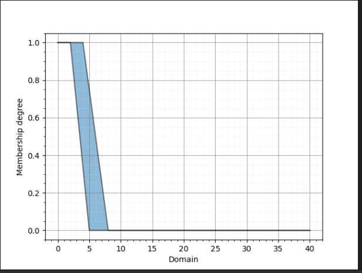
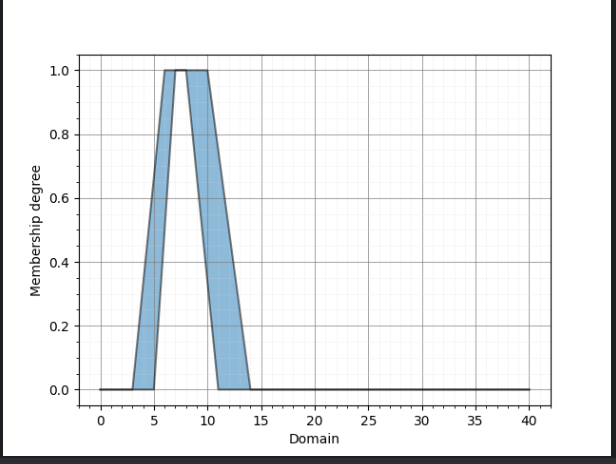
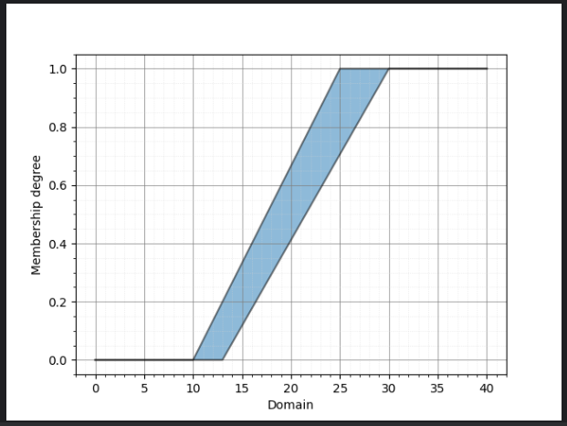
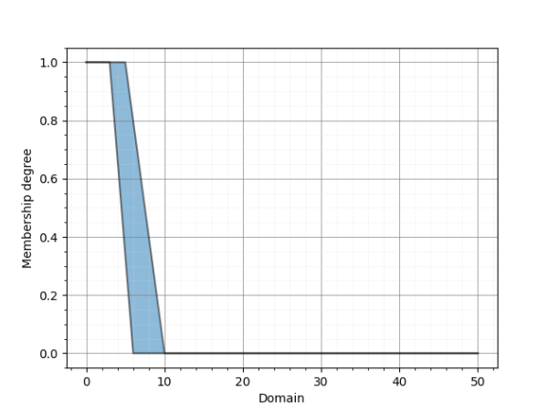
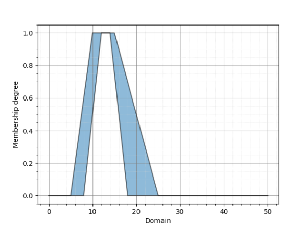
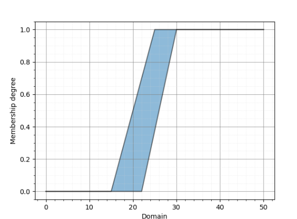
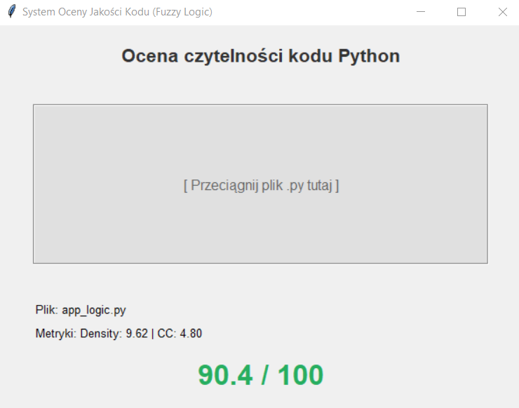
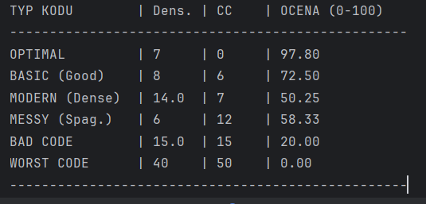
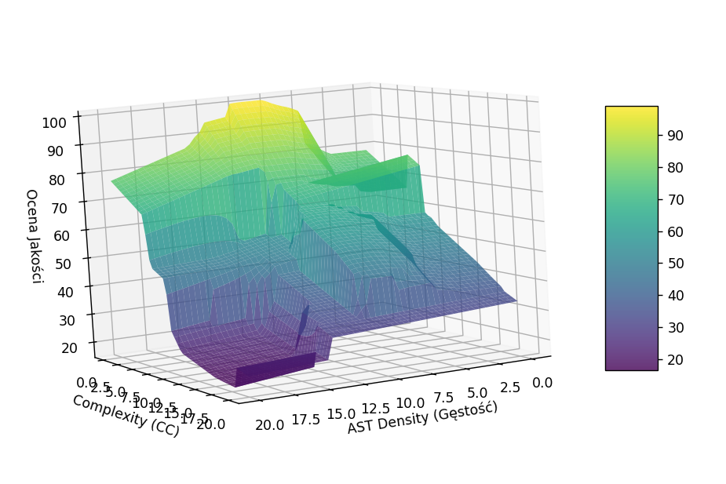

# System Oceny Jakości Kodu Oparty na Wnioskowaniu Rozmytym (Interval Type-2 TSK)

Dokumentacja techniczna projektu wykorzystującego logikę rozmytą typu 2 do automatycznej oceny jakości kodu źródłowego Python.

---

## Spis Treści
1. [Wstęp i Cel Projektu](#1-wstęp-i-cel-projektu)
2. [Struktura Projektu](#2-struktura-projektu)
3. [Metryki Wejściowe](#3-metryki-wejściowe)
4. [Projekt Systemu Rozmytego (Fuzzy Logic Design)](#4-projekt-systemu-rozmytego-fuzzy-logic-design)
    - [Zmienne Lingwistyczne](#zmienne-lingwistyczne)
    - [Funkcje Przynależności (Membership Functions)](#funkcje-przynależności-membership-functions)
5. [Baza Reguł i Wnioskowanie](#5-baza-reguł-i-wnioskowanie-tsk)
6. [Implementacja i Technologie](#6-implementacja-i-technologie)
7. [Instrukcja Uruchomienia](#7-instrukcja-uruchomienia)
8. [Przykłady Działania i Wyniki](#8-przykłady-działania-i-wyniki)
9. [Wykorzystanie modelów LLM w tworzeniu projektu](#9-wykorzystanie-modelów-llm-w-tworzeniu-projektu)
---

## 1. Wstęp i Cel Projektu

Aplikacja dotyczy Systemu Rozmytego który zajmuje się oceną czytelności i złożoności logicznej kodu. Została stworzona na potrzeby zaliczenia przedmiotu Systemy Rozmyte na III Roku Informatyki na Uniwersytecie Rzeszowskim, 2026.

Wraz z coraz bardziej rozpowszechnionym rozwojem oprogramowania i mnogością jego implementacji rośnie znaczenie możliwości oceny kodu. Coraz częściej używa się też narzędzi LLM do jego tworzenia, które, o ile tworzyć działający poprawnie kod potrafią, to niekoniecznie wiedzą jak on wygląda dla użytkownika z punktu widzenia czytelności.

Skupiliśmy się na języku Python ze względu na jego popularność i ze względu na fakt że jest to język wykorzystywany przez nas do nauki Systemów Rozmytych. 

Pomysł na projekt powstał z następującej refleksji -  Jest wiele bibliotek do oceny kodu: **Pylint, Mypy, Bandit;** ale bardziej skupiają się one na zgodności ze standardami kodu, jego stabilności lub bezpieczeństwie.
Z kolei okazało się że ciężko znaleźć coś co opisywało by bardziej subiektywną kategorię - czytelność kodu. A okazuje się że, po pierwsze, dobrze pasuje ona na natury Systemów Rozmytych, które to są - jak sama nazwa mówi - rozmyte, nieostre; A po drugie, pełni ważną rolę dla nas osobiście jako studentów uczących się programować.

## 2. Struktura Projektu

Projekt został podzielony na kilka kluczowych modułów i folderów, aby zapewnić przejrzystość i łatwość w nawigacji:

*   **`app_gui.py`**: Główny plik interfejsu graficznego aplikacji. To tutaj uruchamia się właściwy produkt, z którym interakcję przeprowadza użytkownik końcowy (drag & drop plików).
*   **`app_logic.py`**: Plik zawierający logikę biznesową aplikacji, w tym obliczanie metryk i obsługę systemu rozmytego, wykorzystywana przez GUI.
*   **`usefull_dev_code/app_v2.py`**: Obecna wersja kontrolera w osobnym pliku (wersja deweloperska/prototypowa). Służy do testowania logiki bez pełnego GUI, wizualizuje wykresy zmiennych wejściowych i wyjściowych oraz pozwala na ręczne wprowadzanie danych.
*   **`usefull_dev_code/example_codes`**: Folder zawierający przykładowe kody źródłowe (np. `knapsack_basic.py`, `knapsack_modern.py`, `knapsack_messy.py`). Można na nich przetestować działanie programu i zobaczyć różnice w ocenie jakości.
*   **`usefull_dev_code/pyit2fls_fix`**: Folder zawierający poprawki do biblioteki `pyit2fls`. Został stworzony w celu naprawy błędów w oryginalnej bibliotece, które uniemożliwiały poprawne działanie niektórych funkcji (np. wizualizacji).
*   **`llm_usage`**: Folder dokumentujący wykorzystanie dużych modeli językowych (LLM) w projekcie. Zawiera zapisy rozmów (skrypty) z modelami takimi jak Gemini czy ChatGPT, które pomagały w procesie twórczym i implementacyjnym.

## 3. Metryki Wejściowe

System podejmuje decyzje na podstawie dwóch kluczowych wskaźników wyekstrahowanych z kodu:

### 3.1. Złożoność Cyklomatyczna (Cyclomatic Complexity - CC)

Złożoność Cyklomatyczna jest liczona dzięki bibliotece radon a konkretnie z modułu radon.compelxity i wbudowanej w niej funkcji `cc_visit`. 
Polega na zliczeniu wszystkich
niezależnych ścieżek które są w kodzie i rozpoczyna się od wartości bazowej `1`. <br><br>
Dla każdego bloku kodu lub funkcji wartość bazowa jest  inkrementowana o `+1` jeśli zostanie odnaleziona element taki jak:<br>
Instrukcje warunkowe: `if`, `elif`<br>
Pętle: `for`, `while`<br>
Obsługa wyjątków: `except`<br>
Wyrażenia logiczne w warunkach: `and`, `or`<br>
Instrukcje: `assert`, `with`

Dla każdej funkcji mierzy w ten sposób jej złożoność a później wyciąga średnią dla całego pliku.
Im wyższa jest złożoność cyklomatyczna tym trudniejszy jest kod w zrozumieniu i ciężej jest go testować.

*Przykład:*
````python
def funkcja(x):             #Funkcja więc bazowo cc = 1       
    if x > 0 and x < 100:   # mamy if = cc+1, mamy and cc+1 == cc = 3
        for i in range(x):  # mamy for więc cc+1 == cc= 4
            print(i)        #
    return True             #
````
*Przykład ten ilustruje jak liczymy złożoność cyklometryczną dla przykładowej funkcji.*

Zmienna cyklometryczna swoje uniwersum posiada w przedziale `[0,50]` gdzie:

`[0,10]` - prosty kod łatwy do testowania<br>
`[11,20]` - kod o umierkowanym stopniu złożoności trzeba zrobić solidne testy ale jak najbardziej jest to możliwe<br>
`[21,50]` - trudny kod ciężko go testować<br>
`[>50]` - możemy spokojnie założyć że taki kod jest nietestowalny<br>

**Skala pomiarowa** jest ilorazowa i absolutna a wartości są liczbami naturalnymi. 
Istnieje też 0 które wskazuje że np. sprawdzamy obszar w którym nie deklarujemy żadnej funkcji ani elementów testowanych. 

### 3.2. Gęstość Węzłów AST (AST Node Density)


Zmienna wejściowa **AST Density** opisuje, jak bardzo „zagęszczony” jest kod źródłowy pod względem swojej struktury składniowej.
W praktyce oznacza to, ile elementów drzewa składniowego abstrakcyjnego (Abstract Syntax Tree, AST) przypada średnio na jedną linię kodu. 
Metryka ta została wprowadzona jako próba ilościowego ujęcia czytelności kodu oraz stopnia jego złożoności strukturalnej.

Drzewo AST stanowi wewnętrzną reprezentację programu, w której każda instrukcja, wyrażenie lub blok kodu odpowiada osobnemu węzłowi. 
Im więcej takich węzłów przypada na jedną linię, tym kod jest bardziej zbity i potencjalnie trudniejszy do analizy. 
Wartość AST Density obliczana jest jako stosunek liczby węzłów AST do liczby linii kodu.

W kontekście implementacyjnym metryka AST Density przyjmuje jako wejście kod źródłowy w postaci tekstowej, 
natomiast jako wynik zwraca pojedynczą wartość liczbową określającą średnią liczbę węzłów AST przypadających na jedną linię kodu.

Metryka stosuje wzór:
$$AST Density = Liczba Węzłów AST / Logiczne Linie Kodu$$

*Liczba Węzłów AST* - Liczymy wszystko co trzeba przetworzyć / wykonać tj. `zmienne`,`stałe`,`wywołania funkcji`, `definicje argumentów`, `operatory logiczne`.

*Logiczne Linie Kodu* - Jest to liczba lini kodu który się wykonał, ignorowane są komentarze, puste linie i docstringi.


#### Przykład obliczeń
Jeżeli analizowany fragment kodu składa się z 15 linii i podczas parsowania wygenerowanych zostaje 120 węzłów AST, to wartość gęstości AST wynosi:

AST Density = 120 / 15 = 8.0

Oznacza to, że każda linia kodu zawiera średnio osiem elementów strukturalnych drzewa składniowego.

#### Zakres uniwersum
Zakres wartości dla zmiennej **AST Density** został ustalony na przedział **0–40 węzłów AST na linię kodu**. 
Dolna granica odpowiada bardzo prostym lub trywialnym fragmentom kodu, natomiast górna granica została przyjęta jako świadome ograniczenie projektowe,
pozwalające objąć również skrajnie zagęszczone fragmenty kodu.

Zakres ten jest wystarczająco szeroki, aby uwzględnić nietypowe przypadki (np. bardzo krótkie, lecz silnie zagnieżdżone funkcje), 
a jednocześnie umożliwia stabilne zdefiniowanie zbiorów lingwistycznych oraz funkcji przynależności w systemie rozmytym.

#### Zakres optymalny
Zakres wartości uznawany za optymalny dla zmiennej **AST Density** został przyjęty na podstawie analizy przykładowych plików testowych z folderu `usefull_dev_code\example_codes`
Na przykład dla pliku `knapsack_basic.py`, który stanowił wariant najbardziej zrównoważony pod względem czytelności i struktury, uzyskano wartość AST Density równą **7.61**. 

Dla porównania, kod bardziej zbity (`knapsack_modern.py`) osiągnął wartość **13.89**, natomiast kod rozwlekły i mniej uporządkowany (`knapsack_messy.py`) wartość **6.03**. 
Na tej podstawie przyjęto, że najbardziej czytelny kod znajduje się w przedziale **7–8 węzłów AST na linię kodu**. 
Zakres 7–8 stanowi rdzeń zbioru `Optimal`, czyli obszar, w którym system z największą pewnością uznaje gęstość AST za optymalną; poza tym zakresem przynależność maleje w sposób ciągły. 
(Fragment pliku app_prototype.py poniżej w którym zastosowaliśmy ten rdzeń)

```python
d_optimal = IT2FS(density_universe,
                  trapezoid_mf, [3, 6, 10, 14, 1.0],   # UMF
                  trapezoid_mf, [5, 7, 8, 11, 1.0])    # LMF 
```

#### Skala pomiarowa
AST Density jest zmienną ilościową mierzoną w **skali ilorazowej**, ponieważ posiada naturalne zero, a relacje między wartościami mają sens interpretacyjny 
(np. kod o gęstości 16 jest strukturalnie dwukrotnie bardziej zagęszczony niż kod o gęstości 8).

#### Implementacja i testy
Metryka AST Density została zaprojektowana częściowo przy wsparciu modeli językowych LLM. 
Jej sposób obliczania oraz przykładowe wyniki działania można prześledzić w pliku `ast_test.py`,
gdzie zaprezentowano wartości tej metryki dla różnych fragmentów kodu źródłowego.

## 4. Projekt Systemu Rozmytego (Fuzzy Logic Design)

System oparty jest na **Interval Type-2 Fuzzy Logic System (IT2FLS)** w modelu **Takagi-Sugeno-Kang (TSK)**. Wybór tego rozwiązania podyktowany był koniecznością modelowania niepewności, która jest nierozerwalnie związana z subiektywną oceną jakości kodu.

W przeciwieństwie do klasycznych systemów rozmytych (Type-1), gdzie stopień przynależności jest precyzyjną wartością punktową (np. 0.5), IT2FLS wykorzystuje tzw. **Ślad Niepewności (Footprint of Uncertainty - FOU)**, ograniczony przez górną (Upper MF) i dolną (Lower MF) funkcję przynależności. Dzięki temu system operuje na przedziałach wartości, co znacznie lepiej oddaje naturę ludzkiego rozumowania, w którym definicje pojęć takich jak „złożony” czy „czytelny” są często nieostre i zależne od kontekstu.

Główne zalety tego podejścia w kontekście projektu to zdolność do efektywnego radzenia sobie z niejednoznacznościami oraz zapewnienie płynniejszej powierzchni sterowania. Eliminuje to nagłe skoki oceny przy niewielkich zmianach metryk wejściowych, co potwierdzono w testach – system skutecznie rozróżniał niuanse kodu (np. przypadki o wysokiej gęstości, ale niskiej złożoności), unikając skrajnych ocen dla przypadków granicznych.

Implementacja została zrealizowana w języku Python przy użyciu biblioteki `pyit2fls`. Zdefiniowano zbiory rozmyte typu 2 (IT2FS) za pomocą funkcji trapezoidalnych, a sterownik TSK skonfigurowano z wykorzystaniem iloczynowej t-normy oraz s-normy Einsteina. Ostateczny, ostry wynik (Crisp Output) uzyskiwany jest poprzez algorytm redukcji typu.

### Zmienne Lingwistyczne

#### Wejście 1: Density (Gęstość)
- **Uniwersum:** `0 - 40` węzłów/linię.
- **Zbiory:**
    1. `Low` (Kod rzadki/rozwlekły)
    2. `Optimal` (Kod zrównoważony/czytelny)
    3. `High` (Kod zbity/trudny kognitywnie)

#### Wejście 2: Complexity (Złożoność CC)
- **Uniwersum:** `0 - 50`.
- **Zbiory:**
    1. `Low` (Kod prosty)
    2. `Medium` (Kod przeciętny)
    3. `High` (Kod trudny/zły)

### Funkcje Przynależności (Membership Functions)
Do modelowania niepewności wykorzystano funkcje trapezoidalne z określonym *Upper Membership Function (UMF)* i *Lower Membership Function (LMF)*.

**Funkcje przynależności AST Density**

Low



Optimal



High



**Funkcje przynależności Cyclomatic Complexity**

Low



Medium



High




## 5. Baza Reguł i Wnioskowanie (TSK)

Macierz reguł ($3 \times 3$) definiuje funkcję wyjścia (Quality Score) w zależności od kombinacji wejść.

| Complexity \ Density | Low (Rzadki) | Optimal (Optymalny) | High (Zbity) |
|----------------------|--------------|--------------------|--------------|
| **Low (Prosty)** | *Reguła 1*   | *Reguła 2* | *Reguła 3*<br> |
| **Medium (Średni)** | *Reguła 4*   | *Reguła 5* | *Reguła 6* |
| **High (Trudny)** | *Reguła 7*   | *Reguła 8* | *Reguła 9*<br> |

### Funkcje Wniosku (Consequents)
W modelu TSK wyjście nie jest zbiorem rozmytym, lecz funkcją liniową postaci:
$$f(x) = C + w_1 \cdot Density + w_2 \cdot Complexity$$

## 6. Implementacja i Technologie

Projekt zrealizowano w języku **Python 3.x**.

**Kluczowe biblioteki:**
* `pyit2fls`: Silnik logiki rozmytej typu 2.
* `radon`: Ekstrakcja metryk surowych i CC.
* `ast` (Standard Library): Analiza drzewa składniowego do obliczenia gęstości.
* `numpy` & `matplotlib`: Obliczenia numeryczne i wizualizacja powierzchni sterowania 3D.

## 7. Instrukcja Uruchomienia

### Wymagania
* Python 3.8+
* Zainstalowane pakiety z `requirements.txt`

### Uruchamianie aplikacji GUI
* Uruchom plik `app_gui.py`
* Podaj mu plik .py metodą Drag and Drop
* Pojawią się wartości AST Density i CC, a także zmiennej wyjściowej w skali 0 - 100


### Uruchamianie sterownika
* Otwórz kod `app_v2.py`
* Możesz ręcznie wpisać swoje wartości, bazując na przykładach zaczynających się w linijce 115
* Uruchom kod

## 8. Przykłady Działania i Wyniki

### Przyklad dzialania GUI



### Przykładowe wyniki kontrolera - problem plecakowy, 3 warianty



#### Basic - kod zwrównoważony

```python
def knapsack_bruteforce_simple(W, weights, values):
    n = len(weights)
    best_value = 0

    for mask in range(1 << n):
        total_weight = 0
        total_value = 0

        for i in range(n):
            if mask & (1 << i):
                total_weight += weights[i]
                total_value += values[i]

        if total_weight <= W and total_value > best_value:
            best_value = total_value

    return best_value


if __name__ == "__main__":
    W = 50
    wt = [10, 20, 30]
    val = [60, 100, 120]
    print(knapsack_bruteforce_simple(W, wt, val))
```


#### Modern - kod gęsty, o wysokim AST Density

```python
from itertools import product

def knapsack_bruteforce_modern(W, weights, values):
    n = len(weights)
    return max(
        sum(v for i, v in enumerate(values) if mask[i])
        for mask in product([0, 1], repeat=n)
        if sum(w for i, w in enumerate(weights) if mask[i]) <= W
    )

if __name__ == "__main__":
    W = 50
    wt = [10, 20, 30]
    val = [60, 100, 120]
    print(knapsack_bruteforce_modern(W, wt, val))
```

#### Messy - kod zagmatwany, o wysokim Cyclomatic Complexity

```python
def knapsack_bruteforce_messy(W, weights, values):
    n = len(weights)
    answer = -1
    temp = 0

    for mask in range(0, 2 ** n):
        w = 0
        v = 0
        i = 0

        while i < n:
            if ((mask >> i) & 1) == 1:
                if True:
                    w = w + weights[i]
                    v = v + values[i]
                else:
                    pass
            else:
                if False:
                    w += 0
            i += 1

        if w <= W:
            if v >= answer:
                if v > temp or temp == temp:
                    answer = v
        else:
            if w > W:
                temp = temp

    if answer < 0:
        return 0
    return answer

if __name__ == "__main__":
    W = 50
    wt = [10, 20, 30]
    val = [60, 100, 120]
    print(knapsack_bruteforce_messy(W, wt, val))
```


### Wykres 3D zmiennej wyjściowej




## 9. Wykorzystanie modelów LLM w tworzeniu projektu

Projekt powstał w asyście narzędzi LLM. Głównie był wykorzystywany model Gemini Pro 17. Pomógł on zarówno w kwesti generowania konkretnego kodu, jak i w warstwie kreatywnej. Jego praca obejmuje w szczególności: 

- Zaproponowanie  **AST Density** jako zmiennej wejściowej modelu
- Stworzenie prototypu aplikacji, który to prototyp był później ręcznie sprawdzany i modyfikowany
- Utworzenie szkieletu niniejszej dokumentacji, która została później ręcznie uzupełniona

Cała rozmowa użytkownika z Gemini została udokumentowana w pliku `Skrypt_rozmowy_Gemini.docx` znajdującym się w folderze `llm_usage` 